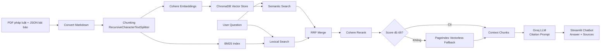

# Bài Nhóm — Drug Law RAG Chatbot & Evaluation

## Mục Tiêu

Xây dựng chatbot RAG trả lời câu hỏi về pháp luật ma túy Việt Nam và tin tức nghệ sĩ liên quan đến ma túy. Hệ thống dùng pipeline cá nhân đã hoàn thiện: hybrid retrieval, reranking, fallback PageIndex và generation có citation.

## Kiến Trúc Hệ Thống



## Thành Phần Chính

| Thành phần | File | Mô tả |
|-----------|------|-------|
| Chatbot UI | `app.py` | Streamlit chat, conversation memory, hiển thị source và score |
| Retrieval | `src/task9_retrieval_pipeline.py` | Semantic + BM25, RRF merge, rerank, fallback PageIndex |
| Generation | `src/task10_generation.py` | Prompt tiếng Việt, citation, chống hallucination |
| Golden dataset | `group_project/evaluation/golden_dataset.json` | Bộ câu hỏi đánh giá |
| Evaluation | `group_project/evaluation/eval_pipeline.py` | Chạy 4 metric và A/B rerank on/off |
| Report | `group_project/evaluation/results.md` | Bảng điểm, worst performers, đề xuất cải tiến |

## Phân Công Công Việc

> Ghi chú: bảng dưới là phân công theo vai trò cho 6 thành viên. Nhóm cập nhật họ tên/MSSV trước khi nộp chính thức; không gán toàn bộ deliverable cho một cá nhân.

| Thành viên | Họ tên | MSSV | Vai trò | Nhiệm vụ | Trạng thái |
|-----------|--------|------|---------|----------|------------|
| P1 | Cập nhật | Cập nhật | Integration Lead | Chuẩn hóa pipeline `retrieve()` và `generate_with_citation()`, kiểm tra vector store chung | Hoàn thành |
| P2 | Cập nhật | Cập nhật | Chatbot / Frontend | Xây Streamlit app, hiển thị answer + source + score | Hoàn thành |
| P3 | Cập nhật | Cập nhật | Conversation + Demo | Memory hội thoại, chuẩn bị kịch bản demo local | Hoàn thành local |
| P4 | Cập nhật | Cập nhật | Eval Dataset + Metrics | Tạo golden dataset >=15 Q&A, implement 4 metric | Hoàn thành |
| P5 | Cập nhật | Cập nhật | A/B + Report | So sánh rerank on/off, phân tích worst performers | Hoàn thành |
| P6 | Cập nhật | Cập nhật | Architecture + README | Diagram, hướng dẫn chạy, phần giải thích demo | Hoàn thành |

## Hướng Dẫn Chạy

### 1. Cài dependency

```bash
pip install -r requirements.txt
```

Các package quan trọng với bản implement hiện tại:

- `chromadb`: vector store local
- `cohere`: embedding và reranking
- `groq`: generation
- `streamlit`: chatbot UI

### 2. Tạo file môi trường

```bash
copy .env.example .env
```

Cần điền tối thiểu:

```bash
COHERE_API_KEY=...
GROQ_API_KEY=...
```

`PAGEINDEX_API_KEY` là tùy chọn. Nếu PageIndex lỗi hoặc hết quota, pipeline tự giữ kết quả hybrid thay vì crash.

### 3. Build lại vector store nếu cần

```bash
python -m src.task4_chunking_indexing
```

### 4. Chạy chatbot

```bash
streamlit run app.py
```

Nếu thiếu `GROQ_API_KEY`, app vẫn có thể demo retrieval-only: hiển thị các đoạn nguồn liên quan nhất.

### 5. Chạy evaluation

```bash
python group_project/evaluation/eval_pipeline.py
```

Script sẽ:

1. Load `golden_dataset.json`
2. Chạy 2 config: `hybrid_rerank` và `hybrid_no_rerank`
3. Tính 4 metric: Faithfulness, Answer Relevance, Context Recall, Context Precision
4. Ghi báo cáo vào `group_project/evaluation/results.md`

## A/B Configs

| Config | Retrieval | Rerank | Mục đích |
|--------|-----------|--------|----------|
| `hybrid_rerank` | Semantic + BM25 + RRF | Có | Config chính để demo |
| `hybrid_no_rerank` | Semantic + BM25 + RRF | Không | Baseline đo tác động reranking |

## Ghi Chú Demo

- BM25 ưu tiên keyword match nên mạnh với câu hỏi có điều luật, tên người, ngày tháng.
- Semantic search bắt được câu hỏi diễn đạt khác từ khóa gốc.
- RRF gộp rank từ semantic và lexical mà không cần so trực tiếp hai thang điểm khác nhau.
- Reranker chấm lại query-document theo cặp, giúp kết quả cuối sát câu hỏi hơn.
- Prompt generation yêu cầu citation cho từng claim và từ chối khi thiếu evidence.
